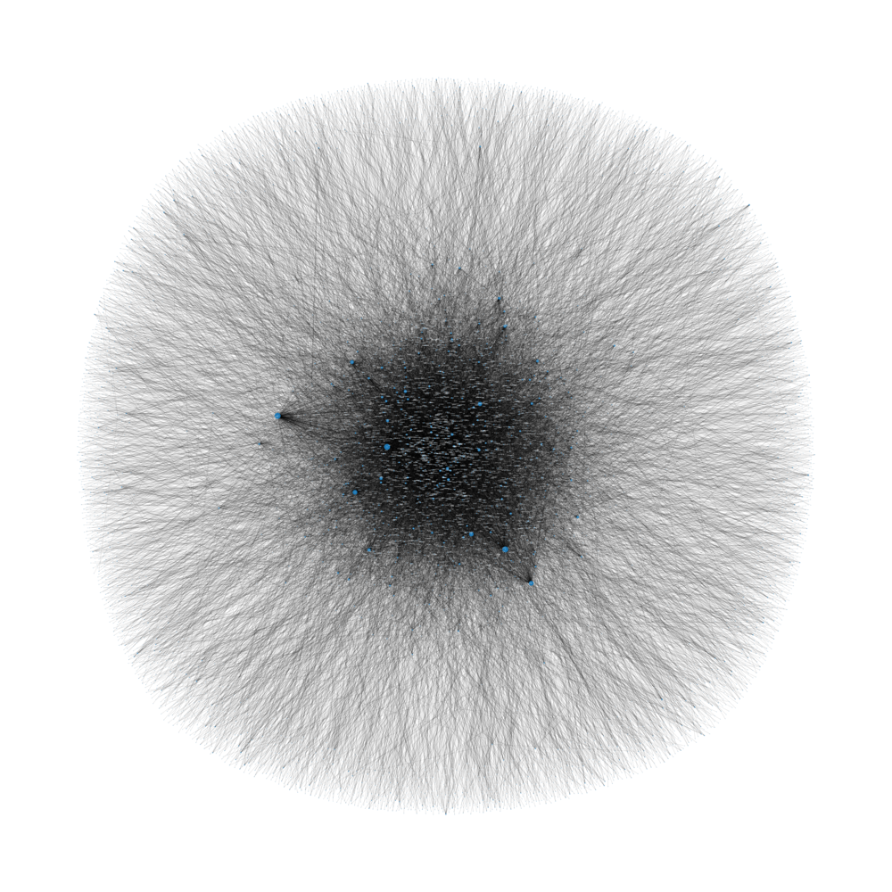

# Acronymy Analysis

## What is Acronymy?

[Acronymy](http://acronymy.net/), made by [David Renshaw](https://twitter.com/dwrensha),
is without question one of my favorite websites. It's an Acronym Dictionary (an Acronymy, if you will)
where users can submit their own definitions to words. A "definition" in this context, is a description
of the word in question that is also an acronym of it. For example, "acronym" is defined as:

TO BE RENDERED

## The Graph

In order to do any analysis of Acronymy, we first need to think of a way to represent the data - after a bit of thought a directed graph seems like a reasonable choice. The graph is constructed in the following manner: I add a vertex for each word and draw an arrow from word $u$ to word $v$ if
$v$ is used in word $u$'s definition. Concretely, in the previous example, the graph would have arrows starting at the word "acronym" and ending at all the words in the definition. This graph is enormous - culling all the vertices with degree $0$ it still has about $10,000$ vertices. Here is a visualization of the graph:

Super illuminating, I know. The size of the vertices corresponds to their in-degree, or how many words use them in their definition. The vertices that are large enough to be visible are common words like "a", and "the". If you are interested, a full-resolution version of the image is availible [here](https://gofile.io/d/0mWlfr). The colors of the words are irrelevant, I used a rough heuristic to try and make them visible on the background, but it's not perfect and if you have any ideas for how to improve it please let me know!

## Basic Analysis

Naturally, I had a few questions about the graph. Some basic statistics about the graph. It has $21159$ edges, $9049$ vertices, and an average degree of $4.68$. If you wanted to be able to understand the entire dictionary, you would need the definitions of $5275$ words, but if you exclude the words which are used in one or fewer definitions this number goes down to $1544$. David then suggested looking at connected components of which there are $21$. Besides the "main" one, they all have size less than $7$ and arise from a word having a defintion which has no defined words. For example, the set
$\{\text{anxious}, \text{remorseful}, \text{afraid}, \text{intimidated}, \text{alarmed}, \text{dazed}, \text{frightful}\}$ is its own connected component where "afraid" stands for "anxious frightful remorseful alarmed intimidated dazed" and none of those words are defined (at the time of writing).

## Generalized Recursive Arcronyms

I **love** recursive acronyms. Genuinely, if I ever have a kid (or pet or something) I will name them a recursive acronym because I love them so much. If you've had the misfortune of going your entire life without encountering recursive acronyms, it's a fairly simple premise - it's just an acronym in which one of the letter stands for itself. The most famous example is GNU which stands for "GNU's not Unix". I have much more to say on regular recursive acronyms, but that's for another day. 

While working on this project, I realized Acronymy let's you generalize the notion of a recursive acronym! Suppose word $w$ has a definition $u\, v$. There's nothing special going on here, but what if $u$ has definition $w \, s$. Well then you could say that $w$ *actually* is defined as $w\, s\, v$ by replacing $u$ with its definition. In fact, these generalized recursive acronyms are exactly the cycles in the graph! With this information in hand, we can find a bunch of them! My personal favorite is "yas" stands for "yet another slay" and "slay" stands for "stylish, lavish, and yas". So really, "slay", stands for "stylish, lavish, and stylish, lavish, and ..." which I think is incredibly fitting. This list of all "essentially unique" generalized recursive acronyms of length less than 10 can be found [here](https://pastebin.com/by09v8Zv). (These might be outdated from new definitions.) 

It turns out that it's very easy to make lots of generalized recursive acronyms by taking an existing one and changing one or two words to arrive at a common word. For example, we have two sequences of words that constitute a recursive acronym in "onward ways your you unit upper under retreat to" and "onward ways your you unit upper under retreat track to". Including all of these is pretty boring so the list is filtered for acronyms which share very few words. There are $1749$ unique words that appear in generalized recursive acronyms of length less than $10$ which I think is really cool! Once every word is defined, we'll have tons of generalized recursive acronyms! The only words that won't be part of one is those who are used in no defintions - that might be rarer than the ones that are, but that's ok I still think generalized recursive acronyms are cool :D

## Further Work

There is much to be done in the world of acronyms! A not-so-surprising fact is that adjacent words in the graph are often similar in meaning - what would happen if we used the distance between two vertices as a semantic distance function? I doubt the results would be good, but would it be passable?

Also, I would love to make the graph more readable. Any suggestions on how to do that would be greatly appreciated!

## Additional Notes

Thanks for reading this far! If you're interested, you can find the code I used to do all of this analysis [on my github](https://github.com/zaxioms) (but it's in no way cleaned up for use). And of course, thank you so much to David Renshaw for helping me along in this project, and of course, making Acronymy.